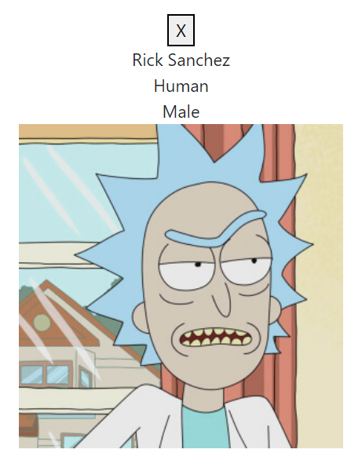
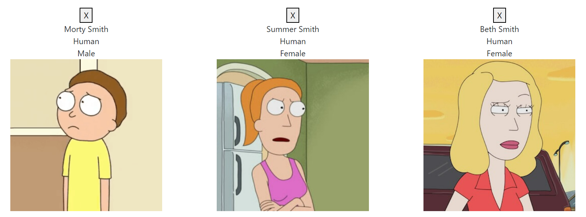
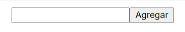
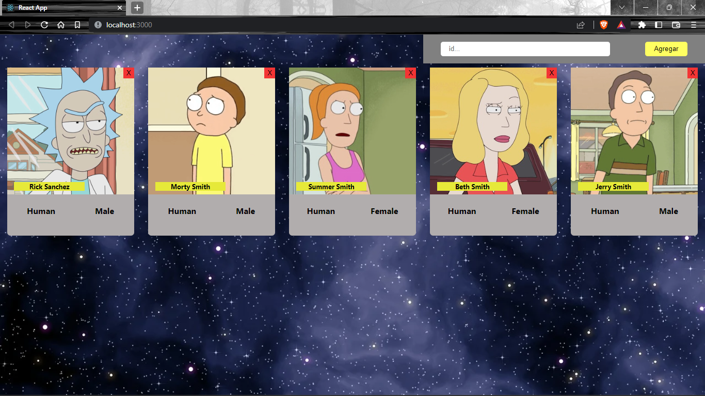
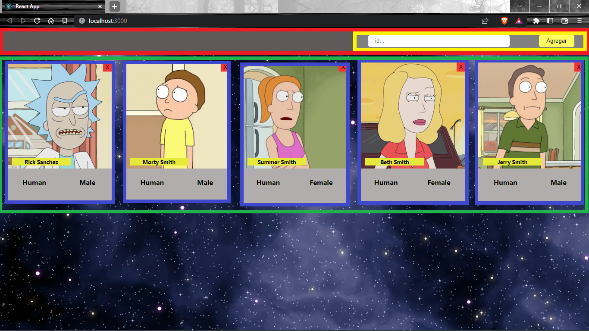
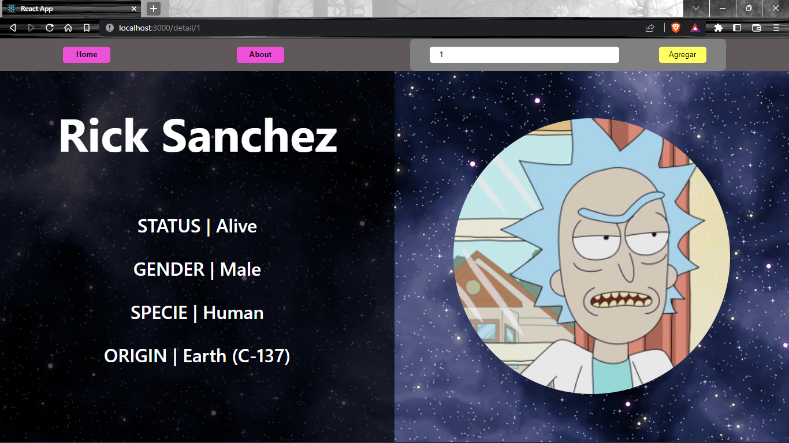
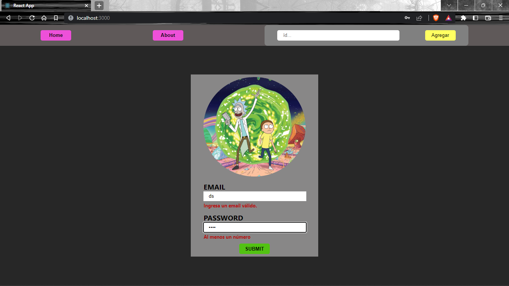

## **💻 RICK AND MORTY APP 💻**

---
## Índice

- [React Intro](#-react-intro)
  - [Ejercicio 1](#-ejercicio-1)
  - [Ejercicio 2 - Card](#-ejercicio-2--card)
  - [Ejercicio 3 - Cards](#-ejercicio-3--cards)
  - [Ejercicio 4 - SearchBar](#-ejercicio-4--searchbar)
- [React Estilos](#-react-estilos)
  - [Ejercicio 5](#-ejercicio-5)
- [React Estado LifeCycle](#-react-estado-lifecycle)
  - [Ejercicio 6 - Nav](#-ejercicio-6--nav)
  - [Ejercicio 7 - Home](#-ejercicio-7--home)
  - [Ejercicio 8 - Estado](#-ejercicio-8--estado)
  - [Ejercicio 9 - On Search](#-ejercicio-9--on-search)
  - [Ejercicio 10 - SearchBar & onSearch](#-ejercicio-10--searchbar--onsearch)
  - [Ejercicio Extra 1](#-ejercicio-extra-1)
- [React Routing](#-react-routing)
  - [Ejercicio 14 - Instalación y configuración](#-ejercicio-14--instalación-y-configuración)
  - [Ejercicio 15 - About](#-ejercicio-15--about)
  - [Ejercicio 16 - Routing](#-ejercicio-16--routing)
  - [Ejercicio 17 - Detail redirection](#-ejercicio-17--detail-redirection)
  - [Ejercicio 18 - Detail](#-ejercicio-18--detail)
  - [Ejercicio 19 - Detail rendering](#-ejercicio-19--detail-rendering)
  - [Ejercicio Extra 2](#-ejercicio-extra-2)
- [React Forms](#-react-forms)
  - [Ejercicio 20 - Form](#-ejercicio-20--form)
  - [Ejercicio 21 - Routing](#-ejercicio-21--routing)
  - [Ejercicio 22 - Form control](#-ejercicio-22--form-control)
  - [Ejercicio 23 - Validaciones](#-ejercicio-23--validaciones)
  - [Ejercicio 24 - Seguridad](#-ejercicio-24--seguridad)
  - [Ejercicio 25 - Login](#-ejercicio-25--login)
  - [Ejercicio Extra 3](#-ejercicio-extra-3)
- [React Redux](#-react-redux)
  - [Ejercicio 26 - Redux & Configuration](#-ejercicio-26--redux--configuration)
  - [Ejercicio 27 - Actions](#-ejercicio-27--actions)
  - [Ejercicio 28 - Reducer](#-ejercicio-28--reducer)
  - [Ejercicio 29 - Fav button](#-ejercicio-29--fav-button)
  - [Ejercicio 30 - Favorites](#-ejercicio-30--favorites)
  - [Ejercicio Extra 4](#-ejercicio-extra-4)
- [React Hooks](#-react-hooks)
  - [Ejercicio 31 - Actions](#-ejercicio-31--actions)
  - [Ejercicio 32 - Reducer](#-ejercicio-32--reducer)
  - [Ejercicio 33 - Filtro & Ordenamiento](#-ejercicio-33--filtro--ordenamiento)
  - [Ejercicio 34 - Forzado de render](#-ejercicio-34--forzado-de-render)
  - [Ejercicio Extra 5](#-ejercicio-extra-5)
    
---

# **💪 React Intro**

---

En esta homework vamos a crear nuestro proyecto de **Rick and Morty**. Comenzaremos construyendo nuestros primeros componentes: **card**, **cards** y **searchBar**.

</br >

---

<br />

## **👩‍💻 EJERCICIO 1**

Tu primer paso será ejecutar el comando **`npm install`** para instalar todas las dependencias dentro de esta homework.

En el archivo **`App.js`** ya hay importado 3 componentes: **Card**, **Cards** y **SearchBar**. Estos componentes reciben propiedades y están siendo renderizados en nuestra aplicación.

<br />

---

## **👩‍💻 EJERCICIO 2 | Card**

Dirígete al componente **`Card`** y renderiza las siguientes propiedades de los personajes:

- **name**: nombre.
- **status**: status.
- **species**: especie.
- **gender**: género.
- **origin**: origen (ten en cuenta que el nombre del origen viene dentro de otra propiedad llamada **`name`**).
- **image**: imagen.

Además, cuando el usuario haga click en la **X** de "cerrar", debe ejecutarse una función que también viene como props llamada **onClose**.

> [**NOTA**]: por el momento, toda la información de los personajes la vamos a obtener a partir del archivo [**`data.js`**](./src//data.js)



<br />

---

## **👩‍💻 EJERCICIO 3 | Cards**

Utilizaremos este componente para renderizar muchos componentes **`Card`**. En otras palabras, este componente será el "_contenedor_" de todas las Cards.

Lo primero que debes hacer es recibir la propiedad **`characters`** mediante las props. Esta propiedad es una arreglo con todos tus personajes. Por cada uno de ellos deberás renderizar un componente **`Card`** pasándole todas las propiedades que ya mencionamos en el ejercicio anterior.

> [**NOTA**]: agrega una propiedad llamada **`key`** y que sea igual al ID del personaje.

> [**NOTA**]: puedes guiarte con la [**`documentación de React`**](https://es.reactjs.org/docs/lists-and-keys.html#rendering-multiple-components) para realizar este ejercicio.



<br />

---

## **👩‍💻 EJERCICIO 4 | SearchBar**

Este componente nos permitirá buscar y agregar nuevos personajes a nuestra aplicación.

Recibe por props una función **`onSearch`**. La función **`onSearch`** se debe ejecutar cuando se haga click en el botón **`Agregar`**.



<br />

---

# **💪 React Estilos**

---

En esta homework podrás escoger entre cualquiera de los tipos de estilos que hemos aprendido en la lecture para aplicarlos en tu aplicación:

- **Legacy**
- **Inline Styling**
- **CSS Module**
- **Styled Components**

> [**NOTA**]: en caso de utilizar **`Styled Components`** deberás instalar dicha dependencia desde la carpeta raíz de tu proyecto de **_Rick & Morty:_**

```bash
    npm install styled-components
```

<br />

---

## **👩‍💻 EJERCICIO 5**

¡Tu tarea consiste en agregar estilos CSS para que los componentes **Card**, **Cards** y **SearchBar** se vean increibles!

No hay consignas que debas seguir, puedes darle tu toque personal. **Sé creativ@!** 🧑‍🎨

Puedes guiarte con esta imagen:



---

# **💪 React Estado LifeCycle**

---

Hasta el momento, en nuestra **Rick & Morty App** tenemos estos 3 componentes: **Card**, **Cards** y **SearchBar**.

Adicionalmente, crearemos otro componente denominado **`Nav`** que será nuestra barra superior de navegación, el cual envolverá a la **`SearchBar`**.

<br />

---

## **👩‍💻 EJERCICIO 6 | Nav**

1. Dirígete a tu archivo **`App.js`** y elimina tu SearchBar.
2. Crear el componente **`Nav`** dentro de la carpeta "**_components_**".
3. Renderiza la SearchBar dentro de este componente.

<br />

---

## **👩‍💻 EJERCICIO 7 | Home**

1. Elimina la **Card** "_suelta_" que se está renderizando.

2. Importa y renderiza el componente **`Nav`**.

3. ¡Aplica los estilos que más quieras!

Puedes guiarte a partir de la siguiente imagen cómo puede quedar tu aplicación:



> - **Recuadro rojo**: Nav
> - **Recuadro amarillo**: SearchBar
> - **Recuadro verde**: Cards
> - **Recuadro azul**: Card

<br />

---

## **👩‍💻 EJERCICIO 8 | Estado**

En este momento estamos dependiendo de un archivo **`data.js`** para recibir a los personajes. Lo que haremos ahora será crear un estado que nos permita almacenar personajes directamente.

Para esto, dirígete al componente **`App.js`** y:

1. Elimina el import y el archivo **`data.js`**. A partir de ahora ya no lo utilizaremos.
2. Importa el hook useState.
3. Crea un estado local llamado `characters` el cual se debe inicializar como un arreglo vacío.

<br />

---

## **👩‍💻 EJERCICIO 9 | On Search**

Ahora crearás una función llamada **`onSearch`** que te servirá para agregar nuevos personajes al estado que creaste en el ejercicio anterior.

1. Crea una función llamada **onSearch** en tu archivo **`App.js`**.
2. Cada vez que esta función sea ejecutada deberá agregar un nuevo personaje a tu estado local **characters**.

Como por el momento no vamos a recibir nuevos personajes, utilizaremos uno "_por default_". Es decir, cada vez que se ejecute la función anterior se debe agregar este personaje al estado local.

```js
const example = {
  id: 1,
  name: 'Rick Sanchez',
  status: 'Alive',
  species: 'Human',
  gender: 'Male',
  origin: {
    name: 'Earth (C-137)',
    url: 'https://rickandmortyapi.com/api/location/1',
  },
  image: 'https://rickandmortyapi.com/api/character/avatar/1.jpeg',
};
```

<br />

---

## **👩‍💻 EJERCICIO 10 | SearchBar & onSearch**

Una vez que hayas creado la función **`onSearch`** deberás:

1. Pasársela como propiedad al componente **`Nav`**.
2. Pasársela como propiedad al componente **`SearchBar`**.

¡Listo! Si levantas tu proyecto y compruebas en tu navegador, cade vez que haces click sobre el botón "**_Agregar_**", se mostrará un nuevo personaje. Debería quedar algo así:


<br />

---

## **🔎 ALTO AQUÍ**

Hasta el momento podemos agregar a un mismo personaje dentro de nuestra aplicación, pero... ¿Cómo podríamos agregar a distintos personajes?

🤓 Una buena idea sería utilizar nuestra SearchBar, ¿no te parece?

Podríamos escribir dentro de nuestra SearchBar el **ID** de un personaje, y que este se agregue automáticamente en nuestra aplicación.

✅ ¡Sigamos para descrubir cómo llevar esto a cabo!

<br />

---

## **👩‍💻 EJERCICIO 11 | Parámetros**

Ahora nos dirigiremos a la **`SearchBar`** para realizar algunas modificaciones. De esta forma podremos guardar el **ID** que escriba el usuario de nuestra aplicación.

1. Importa y crea un estado local llamado **id**. Debe inicializarse como un string vacío.
2. Crea una función **handleChange** de modo que, cada vez que el usuario escriba algo en el input, este se guarde en el estado local **id**.
3. No te olvides de pasarle esta función al input, y asignarle a este el estado local como su **`value`**.
4. Una vez que hayas cumplido con todos estos pasos, asegúrate de que cada vez que se ejecute la función **`onSearch`** esa reciba el estado **id** como argumento.

<br />

---

## **👩‍💻 EJERCICIO 12 | API Connection**

En este ejercicio conectaremos nuestra aplicación con la API de Rick & Morty mediante esta URL: **`https://rym2.up.railway.app/api/character/10?key={tuApiKey}`**.

Donde tu APIKEY está compuesta de la siguiente manera: **`pi-{usuario-de-github}`**. Recuerda que tu usuario de GitHub debe ir en minúsculas, por ejemplo: **pi-misuaurio**.

Ahora modificaremos la función **`onSearch`** para que busque nuevos personajes en la API de [**Rick & Morty**](https://rickandmortyapi.com). Para esto:

1. Instala la dependencia "**axios**". Una vez instala impórtala en el componente **`App.js`**.

2. Elimina la función **`onSearch`** que ya creaste y remplázala por esta nueva función:

```js
function onSearch(id) {
  axios(`https://rym2.up.railway.app/api/character/${id}?key={tuApiKey}`).then(({data}) => {
    if (data.name) {
      setCharacters(oldChars => [...oldChars, data]);
    } else {
      window.alert('¡No hay personajes con este ID!');
    }
  });
}
```

> [**NOTA**]: como aún no hemos visto promesas, tienes este snippet para que copies la funcionalidad.

<br />

---

## **👩‍💻 EJERCICIO 13 | On Close**

En este momento, el componente **`Cards`** les está pasando al componente **`Card`** una función llamada **onClose**. Esta función no está realizando nada más que mostrar un aviso en el navegador. ¡Ahora le daremos la funcionalidad que estamos buscando! Para esto:

1. Dirígete a tu componente **`App.js`** y crea una función con el nombre **onClose**. Esta función recibirá por parámetro un **id**.
2. Dentro de la función deberás realizar un filtro de tu estado local en el que te quedes con todos aquellos personajes cuyo **id** sea distinto al que recibes por parámetro.

> [**NOTA**]: el id que recibes por parámetro es un string, pero el que debes comparar en tus personajes es un number. ¡Parséalo!

3. Setea este resultado en tu estado local **characters**.
4. Dirígete al componente **`Cards`** y envíale el **id** del personaje como propiedad al componente **`Card`**.
5. Finalmente dirígete al componente **`Card`** y pasále el **id** que recibes por props a la funcion **onClose** cuando se ejecuta.

Ahora solo queda que pases esta función al componente **`Cards`**, y que este se la pase al componente **`Card`**.

Este es el resultado esperado:


<br />

---

## **📌 EJERCICIO EXTRA 1**

1. Controla que no se puedan agregar personajes repetidos que ya se muestran en pantalla.

2. Crea un botón en tu componente **`Nav`** que te permita agregar un personaje random.

> [**NOTA**]: hay 826 personajes en total.

---

# **💪 React Routing**

---

En esta homework integraremos **React Router DOM** para enrutar las distintas vistas de nuestra aplicación. Esto quiere decir que podremos decidir en que path o "link" se renderice cada componente.

<br />

---

## **👩‍💻 EJERCICIO 14 | Instalación y configuración**

1. Instala **`react-router-dom`** desde la terminal.
2. Una vez hecho esto, dirígete al archivo **`index.js`** e importa y envuelve toda tu aplicación con "**BrowserRouter**".
3. Importa los componentes "**Routes**" y "**Route**" de _react-router-dom_ en tu archivo **`App.js`**.

<br />

---

## **👩‍💻 EJERCICIO 15 | About**

Ahora crearemos un componente para presentar nuestro perfil. Crea un componente llamado **`About`**. Este componente será una vista que contenga tu información.

Esto es completamente libre. Puedes mostrar incluso una imagen tuya. Esto le servirá a las personas que vean tu App para conocer al creador 🚀✨.

Una vez construido el componente:

1. Dirígete al componente **`Nav`** e importa la etiqueta **Link**.
2. Crea dos botones. Uno con el texto "**About**" y que te redirija a **`/about`**, y otro con el texto "**Home**" que te redirija a **`/home`**.

> [**NOTA**]: podrías utilizar NavLink para darle estilos al link About y Home.

<br />

---

## **👩‍💻 EJERCICIO 16 | Routing**

Comenzaremos creando un componete llamador **Deatil** el cual solo mostrara una etiqueda **`div`** vacía.

Luego, dirígete al archivo **`App.js`**. Ahora crearemos las rutas de los componentes. Cada componente debe renderizarse en las siguientes rutas:

- **Nav** debe que aparecer en todas las rutas.
- **Cards** debe aparecer solo en la ruta **`/home`**.
- **About** debe aparecer solo en la ruta **`/about`**.
- **Detail** debe aparecer solo en la ruta **`/detail/:id`**.

> [**NOTA**]: ten en cuenta que la ruta del componente **Detail** recibe un parámetro **`id`**.

Comprueba en tu navegador que cada componente se renderice en la ruta indicada. Debería quedarte de esta manera:


<br />

---

## **👩‍💻 EJERCICIO 17 | Detail redirection**

En este ejercicio te encargarás de crear la redirección hacia el _detail_ de un personaje. Para esto:

1. Dirígete al componente **`Card`** e importa la etiqueta **Link**.
2. Envuelve el nombre del personaje en esta etiqueta, y que redirija a la ruta **`/detail/:id`**.

> [**NOTA**]: debes pasarle como parámetro el **id** del personaje. personaje para usarlo en el Link.

```js
// Card.js
...
<Link to={`/detail/${id}`} >
  <h3 className="card-name">{name}</h3>
</Link>
...
```

En este momento, cuando hacemos click sobre el nombre de un personaje nos debe redirección a la ruta especificada.


<br />

---

## **👩‍💻 EJERCICIO 18 | Detail**

¡Genial! Las funcionalidades ya están. Ahora es momento de contruir nuestro componente **`Detail`**. Para esto dirígete a este componente y:

1. Importa axios.
2. Importa el hook **useParams** y obten el **id** del personaje.
3. Importa el hook **useState** y crea un estado local con el nombre "**_character_**" que se inicialice como un objeto vacío.
4. En este paso importaremos el hook **useEffect** de **`react`**. Una vez importado, copia el siguiente código y pégalo en el cuerpo del componente.

```js
useEffect(() => {
  axios(`https://rym2.up.railway.app/api/character/${id}?key={tuApiKey}`).then(({data}) => {
    if (data.name) {
      setCharacter(data);
    } else {
      window.alert('No hay personajes con ese ID');
    }
  });
  return setCharacter({});
}, [id]);
```

> [**NOTA**]: este código es el que buscará al personaje de la API cada vez que el componente se monte. Y luego, cada vez que se desmonte, borrará su información.

<br />

---

## **👩‍💻 EJERCICIO 19 | Detail rendering**

Ahora en el estado local **character** ya tenemos disponible toda la información que necesitamos de nuestro personaje. Por lo que:

1. Renderiza **condicionalmente** cada una de estas propiedades.

- **name**
- **status**
- **species**
- **gender**
- **origin** (ten en cuenta que el nombre se guarda dentro de otra propiedad "_name_")
- **image**

Debería quedarte algo como esto:



<br />

> [**NOTA**]: como la información del personaje de obtiene a partir de una petición asincrónica a la API de Rick & Morty, puede que la información aún no esté disponible cuando la quieras renderizar. ¡Aquí es donde debes aplicar renderizado condicional! Te dejamos la [**documentación**](https://reactjs.org/docs/conditional-rendering.html#:~:text=Conditional%20rendering%20in%20React%20works,the%20UI%20to%20match%20them.&text=This%20example%20renders%20a%20different,the%20value%20of%20isLoggedIn%20prop.) como ejemplo.

<br />

---

## **📌 EJERCICIO EXTRA 2**

Ahora te desafiamos a que crees un nuevo componente llamado **Error**. A este componente le podrás dar los estilos que quieras, pero la idea es que se muestre un mensaje de error 404. ¡Puedes inspirarte en este [**ejemplo**](https://github.com/errroorrxd)!

El desafío es el siguiente: haz que este componente se muestre cada vez que el usuario ingrese a cualquier otra ruta que no exista. Es decir que no la hayas especificado en esta homework. Por ejemplo, si creaste una ruta "`/home`" y "`/about`", y el usuario en el navegador escribe y "`/henry`", debería mostrar el componente Error 404.

---

# **💪 React Forms**

---

En esta homework crearemos un sistema de login para nuestra aplicación. De esta forma podremos practicar formularios y, además, cada vez que ingresemos a la App tendremos que tener un email y una contraseña.

---

## **👩‍💻 EJERCICIO 20 | Form**

Ahora crearemos el formulario que nos permitirá logearnos en un futuro.

1. Crea un componente con el nombre **`Form`**.
2. Dentro de este componente se deben renderizar los siguientes elementos:

   - Una etiqueta **`form`** que envolverá a todo el componente.
   - Una etiqueta **`label`** junto con un **`input`** para el email.
   - Una etiqueta **`label`** junto con un **`input`** para la password.
   - Un **`button`** con el texto "**_Submit_**".

¡Dale algo de estilos al componente! Puede quedar algo como esto...


<br />

---

## **👩‍💻 EJERCICIO 21 | Routing**

Ahora le diremos a nuestro formulario dónde debe renderizarse. Para esto:

1. Crea una ruta en el archivo **`App.js`** y crea una ruta para que el formulario se renderice en **`/`**.
2. Si obervas la imagen del ejercicio anterior, la barra de navegación aún se muestra en el **login**. Deberás crear un renderizado condicional, de modo tal que la **`Nav`** se muestre siempre y cuando no estemos en la ruta **`/`**.

> **PISTA:** investiga sobre el hook **`useLocation`** de react-router-dom, y piensa cómo hacer el renderizado condicional.

<br />

---

## **👩‍💻 EJERCICIO 22 | Form control**

En este ejercicio controlaremos y gestionaremos la información que ingrese el usuario en nuestro formulario. Para esto:

1. Crea un estado local llamado **userData**. Este debe inicializarse como un objeto con las propiedades **email** y **password** iguales a un string vacío.
2. Conecta tu estado local con los inputs correspondientes utilizando la propiedad **`value`**.
3. Crea una función llamada **handleChange** que nos permita reflejar el texto ingresado de los inputs en nuestro estado local.

<br />

---

## **👩‍💻 EJERCICIO 23 | Validaciones**

1. En tu componente **`Form`** crea un nuevo estado local llamado "**errors**" que se inicialice como un objeto vacío. Este es el estado que utilizarás para encontrar errores en el formulario.

2. Ahora crea un archivo con el nombre "**validation.js**". Aquí dentro deberás crear una función que valide los siguientes puntos:

**EMAIL**

- el nombre de usuario tiene que ser un email (¡Explora validaciónes REGEX en internet!).
- el nombre de usuario no puede estar vacío.
- el nombre de usuario no puede tener más de 35 caracteres.

**PASSWORD**

- la contraseña tiene que tener al menos un número.
- la contraseña tiene que tener una longitud entre 6 y 10 caracteres.

¡No te olvides de renderizar y darle estilos a tus errores! Te dejamos un ejemplo de cómo puede quedar.



<br />

---

## **👩‍💻 EJERCICIO 24 | Seguridad**

Ahora simularemos una base de datos donde esté guardado un email y password. De esta forma, solo si la información de usuario coincide podrá ingresar a la aplicación. Para esto:

1. En el archivo **`App.js`** crea lo siguiente:

   - Un estado local llamado "**access**" que se inicialice en **`false`**.
   - Una variable llamada "**EMAIL**", y que sea igual a tu email.
   - Una variable "**PASSWORD**", y que sea igual a una contraseña.

</br >

2. Crea una función llamada "**login**" que reciba por parámetro "_userData_". Esta función tiene que preguntar si el email y password que declaraste más arriba son iguales a los que les está llegando por parámetro. En caso afirmativo, el estado local access ahora será **`true`**. Importa el hook "**useNavigate**" de _react-router-dom_ y haremos que nos redirija a **`/home`** si la información es correcta.

```jsx
const navigate = useNavigate();
const [access, setAccess] = useState(false);
const EMAIL = 'ejemplo@gmail.com';
const PASSWORD = 'unaPassword';

function login(userData) {
  if (userData.password === PASSWORD && userData.email === EMAIL) {
    setAccess(true);
    navigate('/home');
  }
}
```

3. Por último, lleva el siguiente código a tu componente (no te olvides de importar el **`useEffect`**).

```javascript
// App.js
useEffect(() => {
  !access && navigate('/');
}, [access]);
```

<br />

---

## **👩‍💻 EJERCICIO 25 | Login**

¡Ahora le daremos la funcionalidad de cambiar los permisos a nuestro login!

1. Dirígete al archivo **`App.js`** y pásale la función **login** que creaste en el ejercicio anterior al componente **`Form`** mediante props.

2. En el componente **`Form`** crea una función "**handleSubmit**". Esta función recibe un evento por parámetro. Deberás ejecutas la función **`e.preventDefault()`**. Luego ejecuta la función "**login**" recibida por props. ¡No te olvides de pasarle por parámetro tu estado local _`userData`_!

3. La función **handleSubmit** debe ejecutarse cuando se hace click en el botón **submit**.

¡Listo! Ya tienes un login funcional 😀🥳🤓

Pruebalo ingresando la información que declaraste previamente.

<br />

---

## **📌 EJERCICIO EXTRA 3**

Te desafiamos a que crees un botón "**Log out**" en tu componente **`Nav`**. Si lo presionas debe quitar los permisos de acceso y redirigirte automáticamente a tu componente **`Form`**.

> [**NOTA**]: lo puedes hacer creando una función **logout** en tu archivo App.js.

---

# **💪 React Redux**

---

En esta homework crearemos un nuevo espacio para guardar a nuestros personajes favoritos. ¡Podremos agregarlos y eliminarlos!

---

## **👩‍💻 EJERCICIO 26 | Redux & Configuration**

Para comenzar, tendrás que instalar las dependencias **redux**, **react-redux** y **redux-thunk** con el comando:

```bash
npm i redux react-redux redux-thunk
```

Ahora, dentro de la carpeta **src** crea una nueva carpeta llamada **redux**. Dentro de esta crea los archivos **`actions.js`**, **`store.js`** y **`reducer.js`**.

Dentro del archivo **`store.js`** haz la configuración del store. Una vez configurado, deberás importarlo en tu archivo **`index.js`** junto con la etiqueta **`Provider`** y envolver tu aplicación a con estos elementos.

<br />

---

## **👩‍💻 EJERCICIO 27 | Actions**

1. Construye dos _actions-creators_:

   - **`addFav`**: esta función recibe un personaje por parámetro. Deberás retornar una action con el **type** igual a "**ADD_FAV**", y el payload igual a ese personaje.

   - **`removeFav`**: esta función recibe un **id** por parámetro. Deberás retornar una action con el **type** igual a "**REMOVE_FAV**", y el payload igual a ese id.

2. Exporta ambas funciones.

> [**NOTA**]: no olvides que el nombre que asignes en la propiedad "TYPE" de tu acción, debe coincidir exactamente con el nombre de los casos que hayas asignado en tu reducer.

<br />

---

## **👩‍💻 EJERCICIO 28 | Reducer**

Dirígete a tu archivo **`reducer.js`**. Allí deberás:

1. Crear un **initialState** con una propiedad llamada "**myFavorites**". Esta propiedad será un arreglo vacío.

2. Luego deberás crear tu reducer. Recuerda que este recibe dos parámetros y que dentro de él hay un switch.

> [**NOTA**]: ten en cuenta el modo en el que lo exportas, y cómo lo importas dentro de tu store.

3. Crea un primer caso llamado "**ADD_FAV**" en el que puedas agregar a un personaje que recibes por payload a tu estado "_myFavorites_".

4. Crea otro caso llamado "**REMOVE_FAV**" en el que puedas eliminar a un personaje de tu estado "_myFavorites_" a partir de un **id** que recibas por payload.

> [**NOTA**]: ten en cuenta que el **`id`** que recibes por payload es un string, y el **`id`** de los personajes es un número.

5. No te olvides de tu caso _**default**_.

<br />

---

## **👩‍💻 EJERCICIO 29 | Fav button**

¡Ahora crearemos un botón para agregar y eliminar a nuestros personajes de los favoritos!

1. Dirígete al componente **`Card`**. Aquí deberás crear una función **mapDispatchToProps** que contenga dos funciones. Esta debe despachar las dos actions que creaste anteriormente (por lo que deberás importarlas).

2. Conecta esta función con tu componente y recibe ambas funciones despachadoras por props.

3. Crea un estado local en tu componente con el nombre **`isFav`** e inicialízalo en **`false`**.

4. Crea una función en el cuerpo del componente llamada **handleFavorite**. Esta función estará dividida en dos partes:

   - Si el estado **isFav** es **`true`**, entonces settea ese estado en false, y despacha la función **removeFav** que recibiste por props pasándole el **id** del personaje como argumento.
   - Si el estado **isFav** es **`false`**, entonces settea ese estado en true, y despacha la función **addFav** que recibiste por props, pasándole **props** como argumento.

5. Ahora te ayudaremos a crear un renderizado condicional. Si tu estado local **`isFav`** es true, entonces se mostrará un botón. Si es false, se mostrará otro botón. Para esto, copia y pega el siguiente código al comienzo del renderizado de tu componente (no te olvides de darle estilos).

```bash
{
   isFav ? (
      <button onClick={handleFavorite}>❤️</button>
   ) : (
      <button onClick={handleFavorite}>🤍</button>
   )
}
```

En este punto debería quedarte algo como esto:


6. Una vez hecho esto, nos tenemos que asegurar que el status de nuestro estado local se mantenga aunque nos vayamos y volvamos al componente. Para esto vamos a agregar una función **mapStateToProps**. Esa función debe traer nuestro estado global **myFavorites**. Finalmente recíbelo por **`props`** dentro de tu componente.

7. Este **`useEffect`** comprobará si el personaje que contiene la **`Card`** ya está dentro de tus favoritos. En ese caso setteará el estado **isFav** en true. Cópialo y pégalo dentro de tu componente (no te olvides de importar este hook).

```javascript
useEffect(() => {
  myFavorites.forEach(fav => {
    if (fav.id === props.id) {
      setIsFav(true);
    }
  });
}, [myFavorites]);
```

> **DESAFÍO:** te desafiamos a que reconstruyas ese useEffect, pero utilizando un **bucle For** en lugar de un **.forEach()**.

<br />

---

## **👩‍💻 EJERCICIO 30 | Favorites**

Dirígete a tu carpeta de componentes y crea uno llamado **`Favorites`**.

1. Crea una ruta en el archivo **`App.js`** para mostrar este componente. El path de la ruta debe ser **`/favorites`**.

2. Crea un botón en tu **`Nav`** con el texto "_Favorites_" que te redirija a esta ruta.

3. Dentro de tu componente **`Favorites`** crea una función **mapStateToProps**. Esta función debe traer el estado global **myFavorites**. Conecta el componente con la función, y recibe el estado global por props.

4. Una vez que tengas la lista de tus personajes favoritos dentro de tu componente, deberás mapearlo y renderizar una **`Card`** con información del personaje (no te olvides de pasarle las propiedades del personaje).

<br />

---

## **✅ ¡LISTO! YA FUNCIONA TODO**

Todo el trabajo que hiciste en esta integración debería darte un resultado y funcionamiento similar a este:


<br />

---

## **📌 EJERCICIO EXTRA 4**

## **¡Ahora te proponemos un desafío!**

Si revisas, esta aplicación tiene un pequeño bug que tendrás que resolver... cuando presionas el ❤️ de una de las Cards el personaje aparece en la vista de "**Favoritos**". Pero si luego eliminas el personaje precionando en la X, este aún permanece en esa vista. Busca la manera para que cuando elimines un personaje, también se elimine de "**Favoritos**".

---

# **💪 React Hooks**

---

En esta homework crearemos dos cosas que harán más completa nuestra aplicación 😄.

- Haremos un **filtrado** para nuestros personajes favoritos. Vamos a filtrar todos los personajes según su género: **`Male`**, **`Female`**, **`Genderless`** y **`unknown`**.

- Por otro lado haremos un **ordenamiento** para nuestros personajes favoritos. Vamos a ordenar todos los personajes por su **id** (de mayor a menor y viceversa).

---

## **👩‍💻 EJERCICIO 31 | Actions**

Dirígete al archivo **`actions`** y crea las siguientes funciones:

1. **`filterCards`**: esta función recibe por parámetro un **gender**. Debe retornar una action con el **type** igual a "**FILTER**" y el payload será igual al parámetro recibido.

2. **`orderCards`**: esta función recibe por parámetro un **orden** (será: **A**: ascendente o **D**: descendente). Debe retornar una action con el **type** igual a "**ORDER**" y el payload será igual al parámetro recibido.

<br />

---

## **👩‍💻 EJERCICIO 32 | Reducer**

Dirígete al archivo **`reducer`** y sigue estos pasos:

1. En tu estado inicial crea una nueva propiedad llamada **allCharacters** que debe ser igual a un arreglo vacío.

2. Modificaremos el caso **ADD_FAV** de la siguiente manera:

   - Dentro de la copia de tu estado global, reemplaza la propiedad **myFavorites** por **allCharacters**.
   - Cuando retornes tu estado, agrega la propiedad **`allCharacters`** que también sea igual a la copia en la que agregaste el nuevo personaje.

   </br >

3. Crea un nuevo caso con el nombre "**FILTER**". Aquí debes crear una copia de tu estado global **allCharacters**. A partir de esta copia filtra todos aquellos personajes que tengan el mismo género que recibes por payload. Finalmente retorna una copia de tu estado, pero que la propiedad **myFavorites** sea igual a este filtrado.

4. Crea un nuevo caso con el nombre "**ORDER**". Aquí vamos a ordenar nuestros personajes favoritos de forma ascendente y descendente. Para esto:

   - Crea una copia de tu estado global **allCharacters**.
   - Utiliza el método **`sort`** para ordenar tus personajes de acuerdo a su **id**.
   - Si el payload es igual a "**A**", los personajes deben ordenarse de menor a mayor.
   - Si el payload es igual a "**D**, los personajes deben ordenarse de mayor a menor.
   - Finalmente retorna tu estado global y en la propiedad **myFavorites** guarda el ordenamiento que hiciste.

> [**NOTA**]: investiga en la web cómo funciona el método **`sort`**.

<br />

---

## **👩‍💻 EJERCICIO 33 | Filtro & Ordenamiento**

Dirígete a tu componente **`Favorites`**. Dentro de él deberás:

1. Crea una etiqueta **`select`**. Dentro de este selector:

   - Crea una etiqueta **`option`** con el atributo **value** igual a **"A"** (ascendente).
   - Crea una etiqueta **`option`** con el atributo **value** igual a **"D"** (descendente).

   ```html
   <option value="Ascendente">Ascendente</option>
   ```

2. Crea una segunda etiqueta **`select`**. Dentro de este selector deberás:

   - Crear 4 etiquetas **`option`**. Cada una con su atributo **value** igual a los siguientes valores: **Male**, **Female**, **Genderless** y **unknown**.

   ```html
   <option value="Male">Male</option>
   ```

> [**NOTA**]: ten en cuenta que la propiedad **`unknown`** debe escribirse en minúsculas, ya que esa el la forma como proviene de la API.

3. Importa las actions que creaste en esta homework y el hook **`useDispatch`**.

4. Crea una función llamada **handleOrder**. En su interior solo debe despachar la action **`orderCards`** pasándole como argumento **`e.target.value`**.

5. Crea una función llamada **handleFilter**. En su interior solo debe despachar la action **`filterCards`** pasándole como argumento **`e.target.value`**.

6. Agrega el atributo **`onChange`** a las etiquetas **`select`** pasándoles las funciones correspondientes a cada una.

<br />

---

<br />

## **👩‍💻 EJERCICIO 34 | Forzado de render**

Ahora solo nos queda, en el componente **`Favorites`** crear un estado local que se llama **aux** e inicialo en **`false`**.

Una vez creado, dentro del **handleOrder** setea este estado en su valor opuesto.

<br />

A esta altura, tu filtro y ordenamiento debería estar funcionando de la siguiente manera:


<br />

---

## **📌 EJERCICIO EXTRA 5**

Agrega una opción adicional en el select del filtro para que muestre todos los personajes. Desarrolla la lógica para que ello ocurra.
